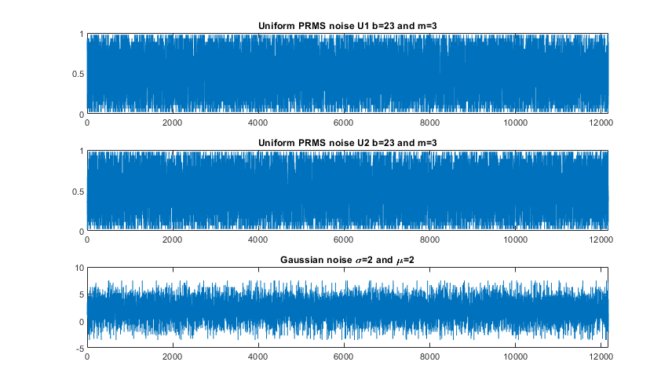
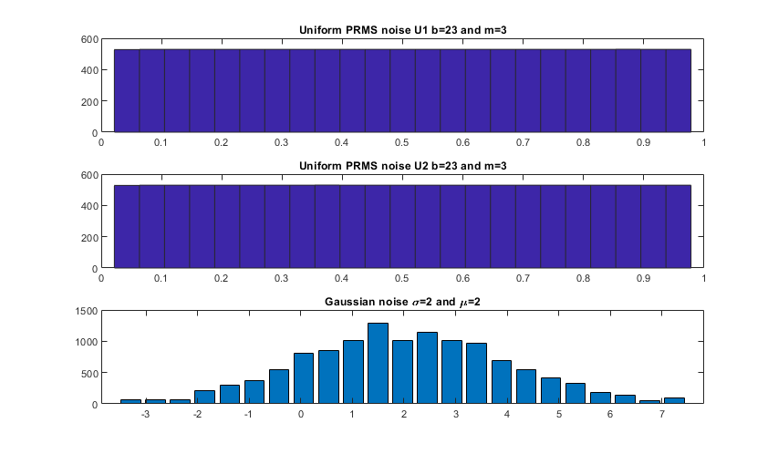

# m_sequence_tools
Matlab utilities functions for generating m-sequences, searching primitive polynomials and gerating different random distributions.


## Pseudo random m-sequences in short
Pseudo random m-sequences (PRMS) also called Maximum length sequences (MLS) are periodic integer sequences based on shift register architecture. Each m-sequence can be defined with three parameters:
 - Base (`b`)
 - Unique length (`m`) or sequence length (`b^m`) 
 - Primitive polynomial (`h(b,m,x)`)
 
 ### Base
 Base of the M-sequence determins the integer range of the sequence elements - `[0, b)`
 The most well known base for PRMSs is binary base 2, Pseudo Random Binary Sequences (PRBS)
 
 ### Unique length
 This parameters determins the sise of the M-sequence. Typical use case m-sequences is pseudo random number generation with some base `b` and some number of digits `m`. For example if you want to create an unique sequence of binary numbers in between of the length 8, you would need to set `b=2` and `m=3`. 
 
### Primitive polynomials and shift registers
 In order to actually generate the random numbers the shift register technique is being used based on the paper:
 > MacWilliams, F. Jessie, and Neil JA Sloane. "Pseudo-random sequences and arrays." Proceedings of the IEEE 64.12 (1976): 1715-1729.
 
Primitive polynomials determine the interconnection of the shifting regiester elements. 

An example of a primitive polynomial for binary base can be seen of the image above. The base of the polynomial is `b=2`, the order of the polynomial is the unique length `m=4` and the actual polynomial has equaitons `h(x) = x^4 + x^3 +1` all addition operations are additions modulo base `b`.

Furthermore figure above depicts an example of the primitive polynomial with base `b=4`, unique length `m=4` and polynomial equation `h(x) = x^4 + 3x^3 + x + 3`


## Usage
There are two functions you can use:
- `prim_poly_search`
- `m_sequence`

### `prim_poly_search`
The funciton iteratively searches for primitive polynomials defined by the function parameters and can be called in one of the three ways:
```Matlab
poly_weights = prim_poly_search(base,m)
```
In this type of funciton call the funcitons is going to try to pass through all the goal space and find all possible primitive polynomials for the given `base` and unique length `m`. If you are interested to find only one primitive polynomial you can specify the parameter `number_of_polys` and call the cunciton this way:
```Matlab
poly_weights = prim_poly_search(base,m,number_of_polys)
```
And finaly you can also provide the function with initial weights for it to start searching from, initaly it starts from all weigths set to 0. For example if you have one set of weitghs and want to find another one, you can provide the last one to the funciton and it will start searchig from that one:
```Matlab
poly_weights = prim_poly_search(base,m,number_of_polys,inital_weights)
```
There are many ways of determining that some polynomial is primitive, but in my case I have found that simple iterative approach with some clever additions performs the fastest. 

### `m_sequence` 
If you are not interested in the primary polynomials but directly in M-sequences you can directly call
```Matlab 
ms = m_sequence(base,m);
```
This funciton returns the full unique m-sequence with length `base^m` with random seed both for shift register and polynomial weights. 
Basically it will give you an array with `base^m` elements. 

## Examples
There are two usage example scripts provided
- `prms_generation_example`
- `noise_geretation_example`

### `prms_generation_example`
This script shows a simple example of usage of shift register and iterative generation of pseudo random number sequences

### `noise_geretation_example`
One of the interesting examples of using pseudo random number generation, especially such a simple form of it, is the noise generation with certain distribution.
The PRMS sequences are very good aproximation of uniform distribution, which you can see from the histograms.


The figures above were outputed by the script and show how well the PRMSs approximate uniform distribution and how using simple methods like [Box-Muller transformations](https://en.wikipedia.org/wiki/Box%E2%80%93Muller_transform) you can have a powerfull real time method of generating different random variables and noises. 

